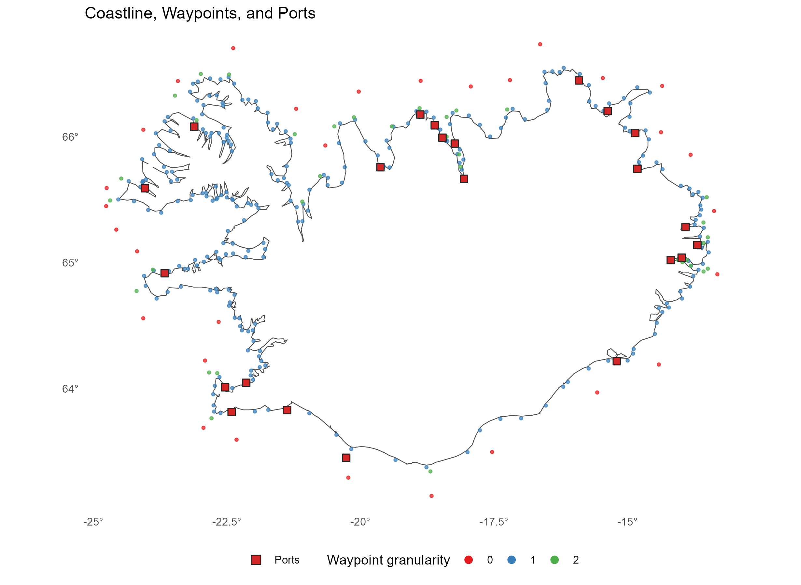
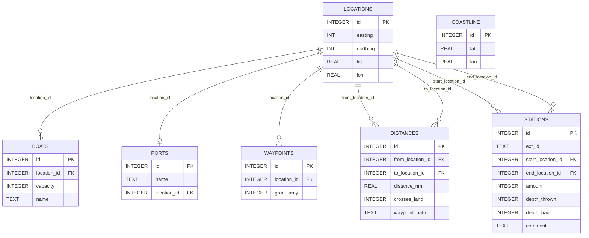
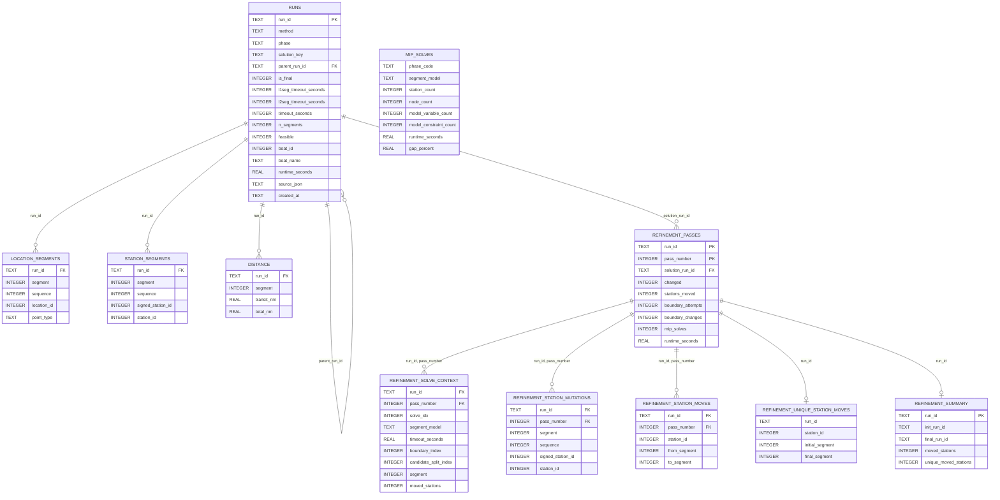

# `dat/`

Input files and generated database for the GSP pipeline.

| File                   | Description                                                               |
|------------------------|---------------------------------------------------------------------------|
| `gsp.db`               | SQLite routing database — generated by `make -C src prepare-routing-data` |
| `solution.db`          | SQLite solution database — generated by `make -C src solution_db`         |
| `island.tsv`           | Coastline source (degmin)                                                 |
| `waypoints.dat`        | Manual waypoints (`WAYP`)                                                 |
| `ports.dat`            | Port definitions (`PORT`)                                                 |
| `boats.dat`            | Vessel definitions (`BOAT`)                                               |
| `stations.dat`         | Trawl station definitions (`STAT`)                                        |
| `survey2023spring.dat` | Historical 2023 spring survey assignments                                 |

> DAT coordinates use degmin storage (`DDMM.mm × 100`). Longitudes are stored as positive west
> values.

---

<table>
<tr>
<td align="center"><br><sub>Waypoints</sub></td>
<td align="center"><br><sub>Survey overview — stations, ports and boats</sub></td>
</tr>
</table>

--- 

## Database schema

### Routing database (`gsp.db`)

The routing database is centered on `locations`, which acts as the shared spatial reference
table for `boats`, `ports`, `waypoints`, `distances`, and `station` endpoints.



---

## Solution database  (`solution.db`)

The `solution.db` is the normalized plotting/reporting database generated
from the JSON files in `sol/`. Build the exporter with the normal C build, then
recreate the database explicitly:

```bash
# make -C src build experiments 
make -C src solution_db
```

It intentionally does not duplicate geography. Route order lives in
`solution.db`; coordinates stay in `gsp.db.locations`. For map plots, join
`solution.db.location_segments.location_id` to `gsp.db.locations.id`.
`location_segments.point_type` uses `BOAT`, `PORT`, `WAYP`, and `STAT`.

The database has three main groups:

- Route state tables: `runs`, `location_segments`, `station_segments`, and
  `distance`. These keep solution lineage and the ordered route/station content.
- Generic MIP facts: `mip_solves`. This table is deliberately run-agnostic and
  is meant for runtime/gap/model-size summaries by `phase_code` and
  `segment_model`.
- Refinement details: `refinement_passes`, `refinement_solve_context`,
  `refinement_station_mutations`, `refinement_station_moves`,
  `refinement_unique_station_moves`, and `refinement_summary`. These keep
  pass-level identity, boundary/candidate context, moved station IDs, per-pass
  and net-unique station moves, and a per-refinement-run summary — all tied to a
  grouped refinement run plus pass number.

`mip_solves` contains `phase_code`, `segment_model`, `station_count`,
`node_count`, `model_variable_count`, `model_constraint_count`,
`runtime_seconds`, and `gap_percent`. Older construction/segment JSONs used
the short solve tuple `[station_count, runtime_seconds, gap_percent]`; the
exporter backfills `node_count` and model-size counts for those files. New
construction/segment JSONs use `[station_count, node_count, mip_size,
runtime_seconds, gap_percent]`, matching the refinement JSONs for the shared
fields.

Refinement JSON variants are grouped by refinement run in the refinement detail
tables. A concrete solution state such as `ci:refinement:l2seg=10:pass1`
remains in `runs.run_id`; in `refinement_passes` it is represented as
`run_id = ci:refinement:l2seg=10`, `pass_number = 1`, and
`solution_run_id = ci:refinement:l2seg=10:pass1`.

`refinement_station_moves` records every per-pass station segment change (one
row per station that moved per pass). `refinement_unique_station_moves`
collapses all passes: one row per station that ended in a different segment than
it started in. `refinement_summary` aggregates totals (cumulative moves and
unique net-moved stations) per refinement run.


