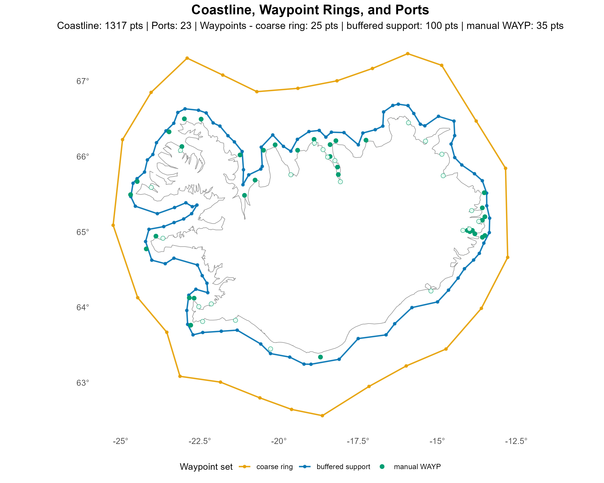
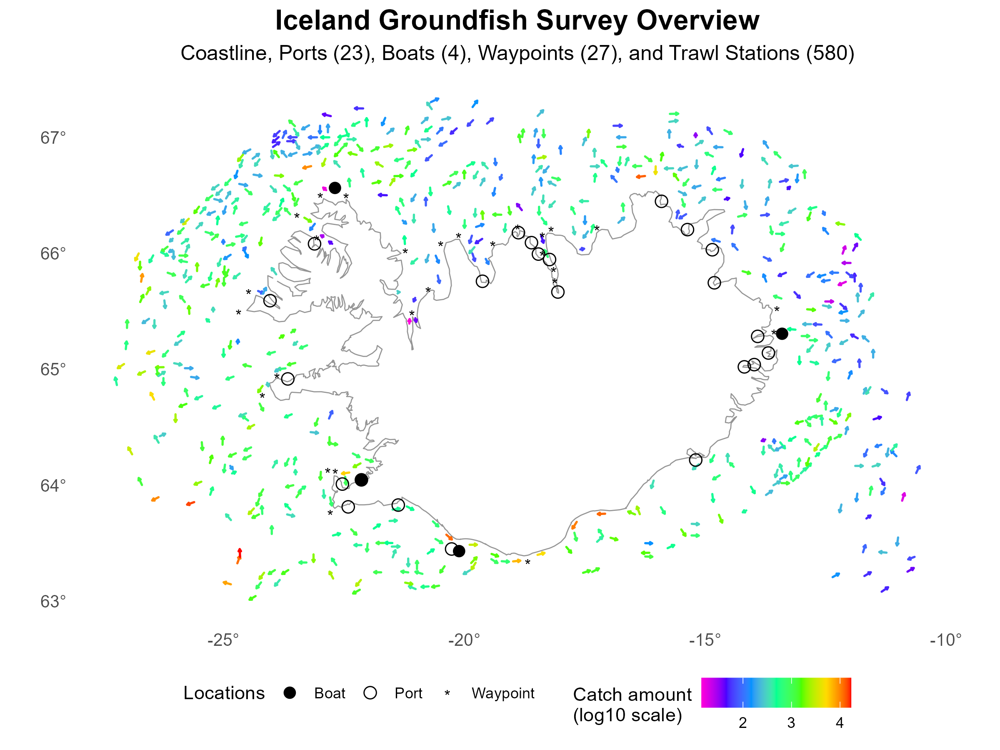
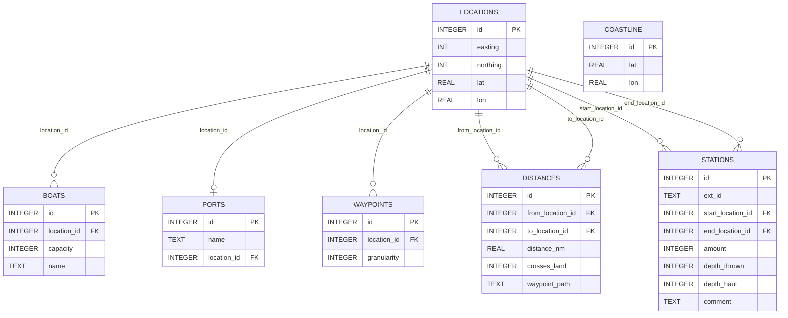

# `dat/`

Input files and generated database for the GSP pipeline.

| File | Description |
|------|-------------|
| `gsp.db` | SQLite routing database — generated by `make -C src prepare-routing-data` |
| `island.tsv` | Coastline source (degmin) |
| `waypoints.dat` | Manual waypoints (`WAYP`) |
| `ports.dat` | Port definitions (`PORT`) |
| `boats.dat` | Vessel definitions (`BOAT`) |
| `stations.dat` | Trawl station definitions (`STAT`) |
| `survey2023spring.dat` | Historical 2023 spring survey assignments |
| `legacy_distances.db` | Legacy distance database for validation |

> DAT coordinates use degmin storage (`DDMM.mm × 100`). Longitudes are stored as positive west values.

---

<table>
<tr>
<td align="center"> Coastline, waypoints and ports</td>
<td align="center"> Survey overview — stations, ports and boats</td>
</tr>
</table>

--- 

## Database schema

The routing database is centered on `locations`, which acts as the shared spatial reference table for boats, ports, waypoints, distances, and station endpoints.

