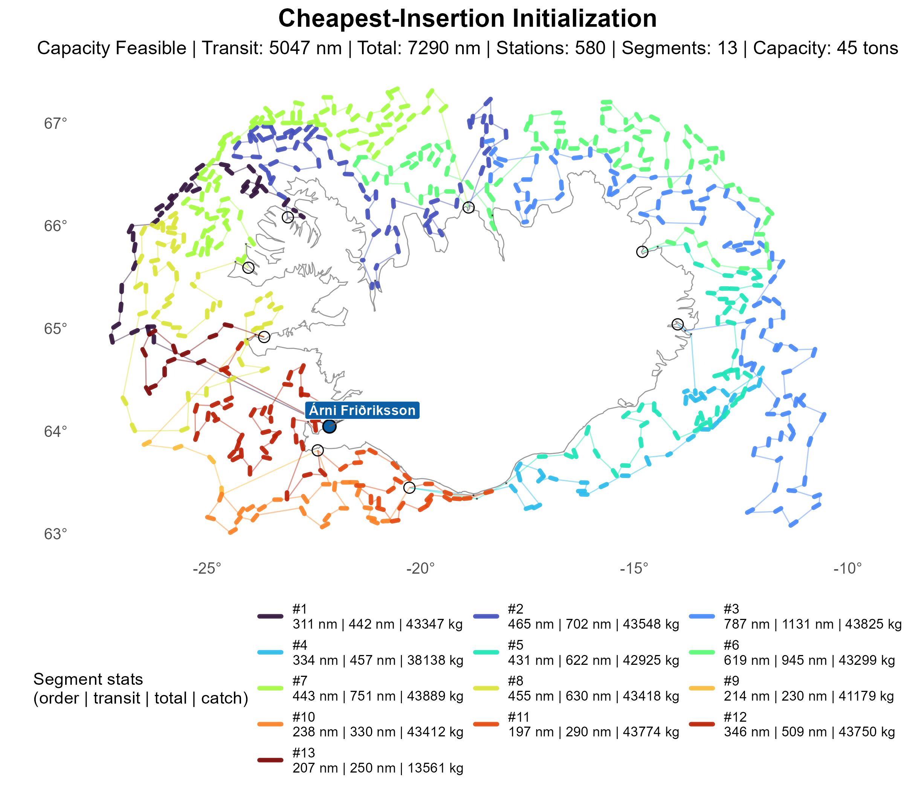
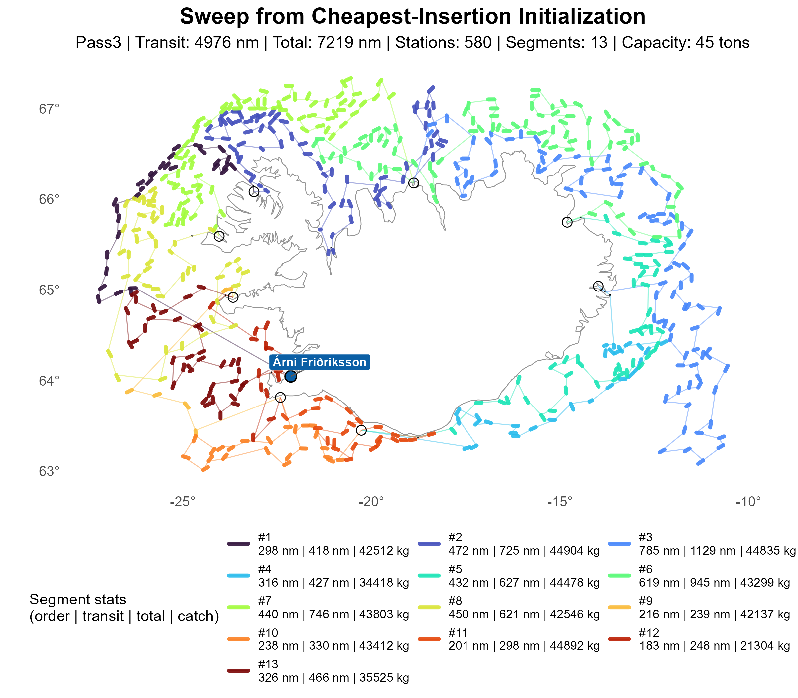

# Cheapest‑Insertion (CI) Initialization

The Cheapest‑Insertion (CI) initialization constructs an initial ordering by iteratively inserting
the unvisited station whose inclusion causes the smallest marginal increase in the total tour
length. At each iteration, the algorithm evaluates all possible insertion positions in the current
partial tour and selects the station–position pair that yields the minimal additional travel
distance.

Compared with nearest‑neighbor, CI invests slightly more computation per step in order to build
smoother, more globally consistent orderings while remaining lightweight and scalable. When a
prospective insertion would violate vessel capacity in the current segment, the algorithm inserts a
port, resets accumulated load, and then continues inserting stations using the same
marginal‑increase rule.

Overall, CI strikes a balance between computational efficiency and route quality: it tends to
produce higher‑quality initial orderings than NN while maintaining low overhead, making it a strong
default initialization for downstream refinement.

-----

## Route Plotting

## Segment Summary

### Initialization (capacity feasible)

|   Segment |   Length | Stations |      Catch | Transit (nm) | Distance (nm) |
|----------:|---------:|---------:|-----------:|-------------:|--------------:|
|         1 |       71 |       35 |      43347 |       311.30 |        441.72 |
|         2 |      127 |       63 |      43548 |       465.39 |        702.21 |
|         3 |      177 |       88 |      43825 |       786.74 |       1131.01 |
|         4 |       65 |       32 |      38138 |       333.76 |        456.85 |
|         5 |       97 |       48 |      42925 |       431.18 |        622.00 |
|         6 |      169 |       84 |      43299 |       618.83 |        945.44 |
|         7 |      159 |       79 |      43889 |       442.77 |        751.38 |
|         8 |       97 |       48 |      43418 |       454.66 |        629.97 |
|         9 |        9 |        4 |      41179 |       214.21 |        230.12 |
|        10 |       47 |       23 |      43412 |       238.05 |        330.45 |
|        11 |       47 |       23 |      43774 |       197.49 |        290.44 |
|        12 |       85 |       42 |      43750 |       345.83 |        508.61 |
|        13 |       22 |       11 |      13561 |       206.79 |        249.64 |
| **Total** | **1172** |  **580** | **528065** |  **5047.00** |   **7289.85** |

### Sweep adjustment (capacity feasible)

|   Segment |  Length | Stations |      Catch | Transit (nm) | Total (nm) |
|----------:|--------:|---------:|-----------:|-------------:|-----------:|
|         1 |      32 |       31 |      42512 |       298.25 |     417.69 |
|         2 |      69 |       68 |      44904 |       472.28 |     724.51 |
|         3 |      89 |       88 |      44835 |       784.89 |    1129.04 |
|         4 |      30 |       29 |      34418 |       316.09 |     427.33 |
|         5 |      50 |       49 |      44478 |       431.73 |     626.58 |
|         6 |      85 |       84 |      43299 |       618.83 |     945.44 |
|         7 |      79 |       78 |      43803 |       439.89 |     745.53 |
|         8 |      48 |       47 |      42546 |       449.82 |     621.38 |
|         9 |       7 |        6 |      42137 |       215.97 |     238.60 |
|        10 |      24 |       23 |      43412 |       238.05 |     330.45 |
|        11 |      25 |       24 |      44892 |       201.32 |     298.28 |
|        12 |      17 |       16 |      21304 |       183.00 |     247.69 |
|        13 |      37 |       37 |      35525 |       325.57 |     466.01 |
| **Total** | **592** |  **580** | **528065** |  **4975.69** | **7218.55** |
