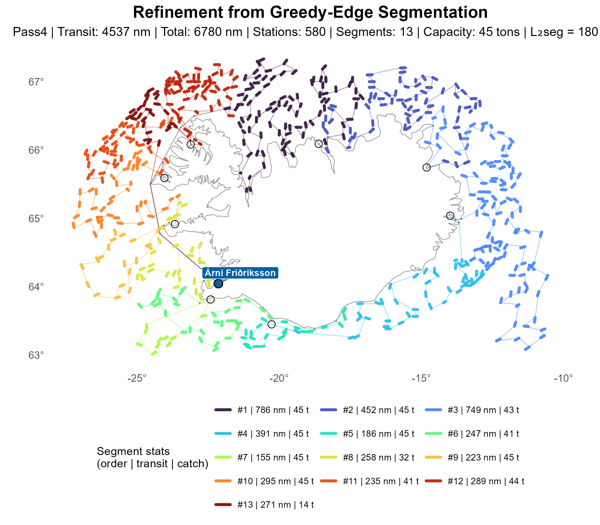

# Greedy‑Edge (GE) Construction

The Greedy‑Edge (GE) construction builds an initial station ordering by following a
Kruskal‑like edge‑selection process. At each step, the algorithm adds the shortest admissible edge
between two stations—subject to feasibility constraints—while ensuring that premature subtours do
not form. This creates a gradually expanding forest of short edges that ultimately forms a single
tour once all stations have been incorporated.

To maintain capacity feasibility, ports are inserted whenever extending the current segment would
exceed the vessel’s load limit. After each insertion, GE continues selecting the next shortest
eligible edge while preserving the no‑subtour rule.

Compared with NN and CI, GE often yields competitive and sometimes high‑quality initial orderings,
leveraging structural information in the underlying distance graph. However, because it builds the
tour based on edge lengths rather than full‑path structure, it can be less stable than CI,
particularly in regions where many similar‑length edges compete.

-----

## Route Plotting

<table><tr>
<td align="center"> Construction</td>
<td align="center"> Segment</td>
<td align="center"> Refinement</td>
</tr></table>
