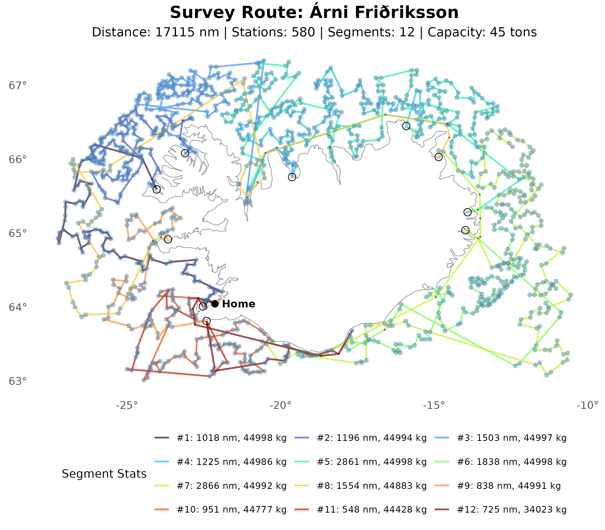

# Nearest-Neighbor (NN) Initialization

The Nearest-Neighbor (NN) initialization constructs an initial ordering of the survey stations by
repeatedly selecting, from the set of unvisited stations, the closest feasible next station
according to the waypoint-aware distance matrix. At each step, the algorithm evaluates whether
adding the next station would exceed the vessel's remaining capacity within the current segment. If
capacity would be violated, a port is inserted, the load is reset, and the process continues from
that port.

Because NN expands the route by always choosing the locally nearest feasible option, it is fast to
compute and scales easily to large station sets. However, its purely greedy, distance-driven
behavior can lead to noisy or irregular segmentations, especially in regions with clustered
stations or sharp load gradients. Despite this, NN provides a lightweight deterministic baseline
that is useful for benchmarking more sophisticated initialization strategies.

The current NN output is:

- `sol/nn/init.json`
- `sol/nn/init.png`

Produced by:

```bash
make -C src-refactor init_nn
```

-----

## Route Plotting



## Segment Summary

|   Segment |   Length | Stations |      Catch | Distance (nm) |
|----------:|---------:|---------:|-----------:|--------------:|
|         1 |       83 |       41 |      44998 |       1018.20 |
|         2 |      135 |       67 |      44994 |       1196.18 |
|         3 |      117 |       58 |      44997 |       1502.73 |
|         4 |      123 |       61 |      44986 |       1225.16 |
|         5 |      187 |       93 |      44998 |       2860.71 |
|         6 |      127 |       63 |      44998 |       1837.71 |
|         7 |      169 |       84 |      44992 |       2865.54 |
|         8 |       47 |       23 |      44883 |       1554.28 |
|         9 |       65 |       32 |      44991 |        838.07 |
|        10 |       79 |       39 |      44777 |        951.47 |
|        11 |       23 |       11 |      44428 |        547.87 |
|        12 |       16 |        8 |      34023 |        725.13 |
| **Total** | **1171** |  **580** | **528065** |  **17115.28** |