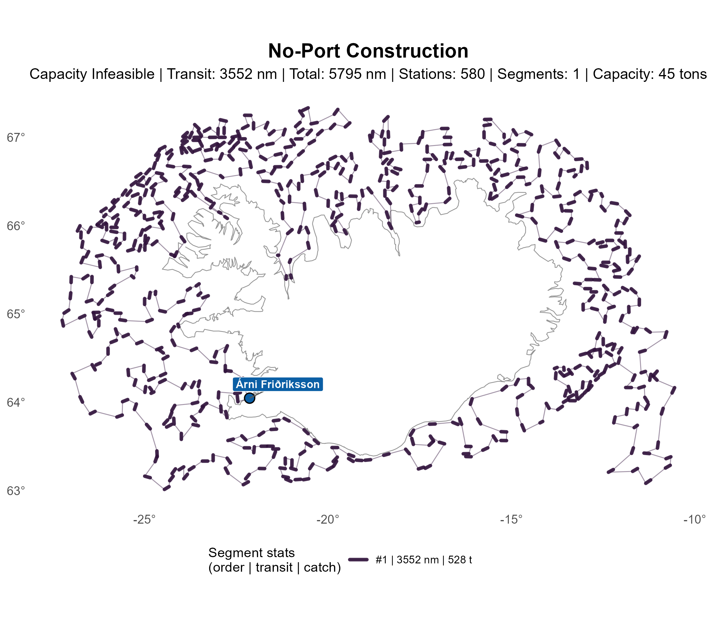
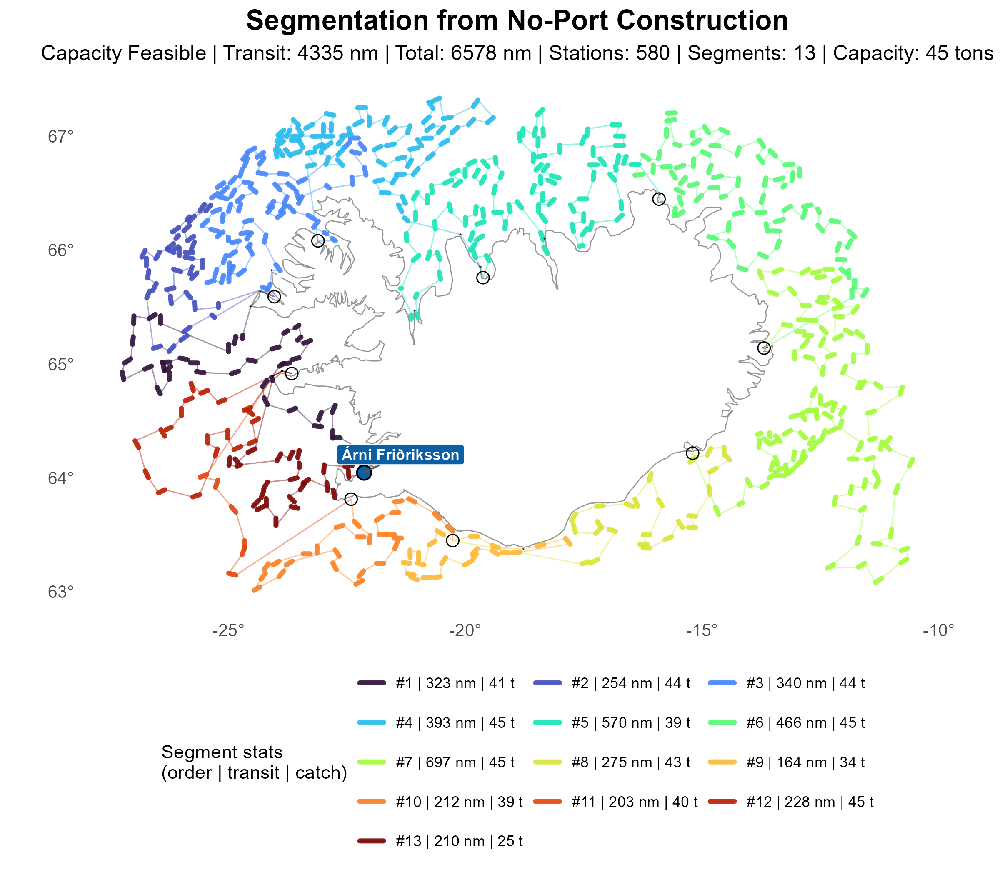
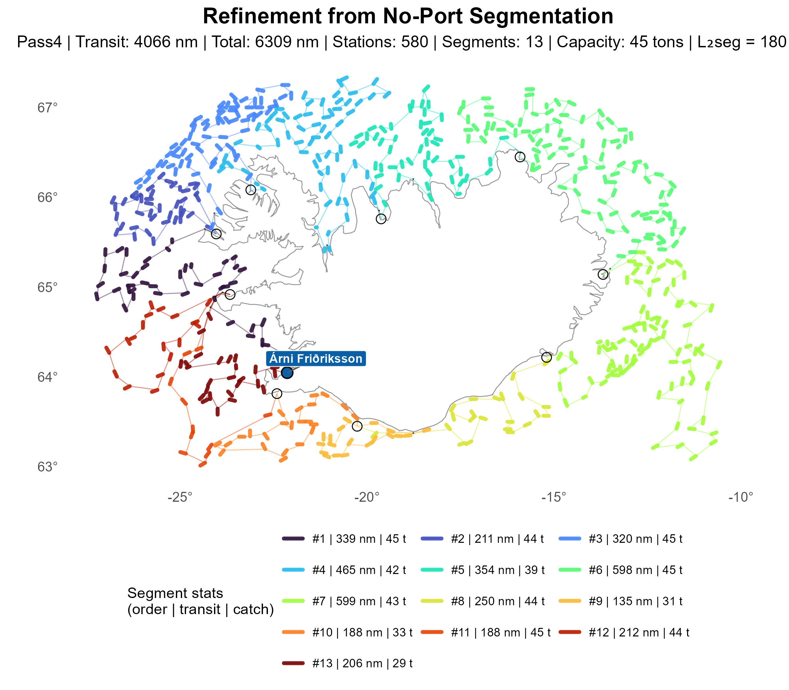

# No-Port (Noport) Construction

The no-port MIP solves a directed TSP over all stations without capacity constraints or port calls.
Each station contributes an entry and exit node; the model finds a Hamiltonian cycle on these
doubled nodes with lazy subtour elimination and orients it back into a signed station order.

This answers only: *"what is the best station ordering if capacity resets are ignored?"*
Ports are inserted afterwards when the ordering is converted into a capacity-feasible route.
Because it is a full directed TSP, noport is considerably more expensive than NN, GE, or CI, but
provides the strongest station-order baseline for downstream refinement.

-----

## Route Plotting

<table><tr>
<td align="center"> Construction</td>
<td align="center"> Segment</td>
<td align="center"> Refinement</td>
</tr></table>
