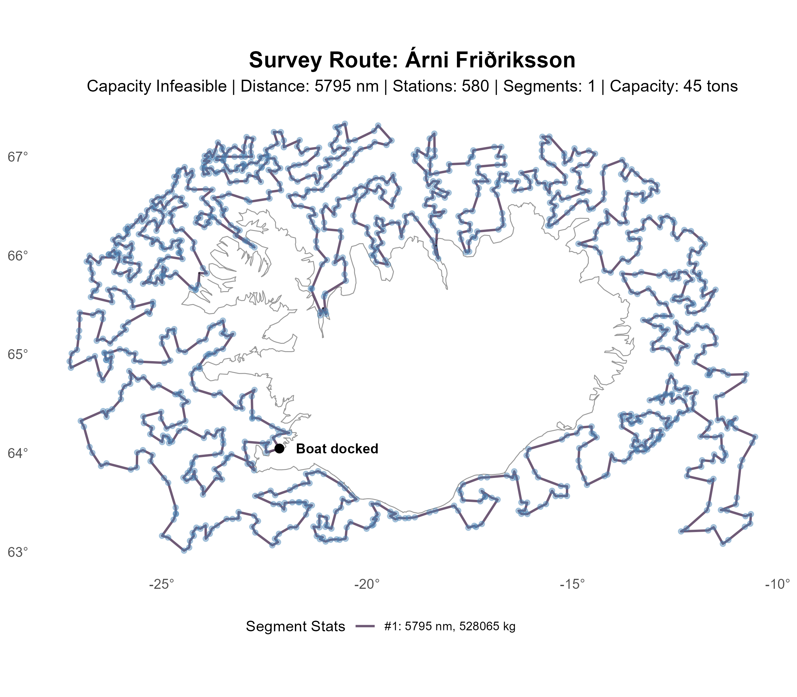

# OPT Initialization

The OPT initialization mirrors the old `src` no-port model. It first solves a directed no-port TSP
over the boat and all stations only. Ports are not part of the optimization model at this stage.
The boat contributes one start endpoint and one end endpoint, and each station contributes its two
directional endpoints. The model then chooses a single Hamiltonian cycle on these doubled nodes with
lazy subtour elimination, and that cycle is oriented back into a signed station order.

High level:

- The no-port MIP optimizes only the port-free station ordering.
- The boat is the anchor of the no-port model, not a nearest or fixed port.
- The boat closure arcs are zero-cost in both directions.
- Ports are inserted only later, when the no-port ordering is converted into a capacity-feasible
  route.

This separation is intentional. The no-port MIP is meant to answer only: *"what is the best station
ordering if capacity resets are ignored?"* It is not the full capacity-feasible routing model.

Because this is still a full directed TSP with lazy subtour elimination, OPT is much more expensive
than NN, GE, or CI. In return, it provides the strongest station-order baseline for later capacity
repair and matheuristic refinement.

## Segment Summary

|   Segment |  Length | Stations |      Catch | Distance (nm) |
|----------:|--------:|---------:|-----------:|--------------:|
|   Segment |  Length | Stations |      Catch | Distance (nm) |
|      ---: |    ---: |     ---: |       ---: |          ---: |
|         1 |     580 |      580 |     528065 |       5794.88 |
| **Total** | **580** |  **580** | **528065** |   **5794.88** |

|   Segment |   Length | Stations |      Catch | Distance (nm) |
|----------:|---------:|---------:|-----------:|--------------:|
|         1 |       81 |       40 |      44394 |        527.44 |
|         2 |       13 |        6 |      28261 |        240.82 |
|         3 |       21 |       10 |      44991 |        199.05 |
|         4 |       69 |       34 |      44676 |        383.58 |
|         5 |       29 |       14 |      36579 |        245.70 |
|         6 |       91 |       45 |      44719 |        588.54 |
|         7 |      243 |      121 |      44241 |       1375.75 |
|         8 |      107 |       53 |      44993 |        608.91 |
|         9 |      177 |       88 |      44749 |       1014.41 |
|        10 |      127 |       63 |      44747 |        644.23 |
|        11 |      107 |       53 |      42140 |        546.72 |
|        12 |       67 |       33 |      44937 |        438.44 |
|        13 |       40 |       20 |      18638 |        220.83 |
| **Total** | **1172** |  **580** | **528065** |   **7034.41** |