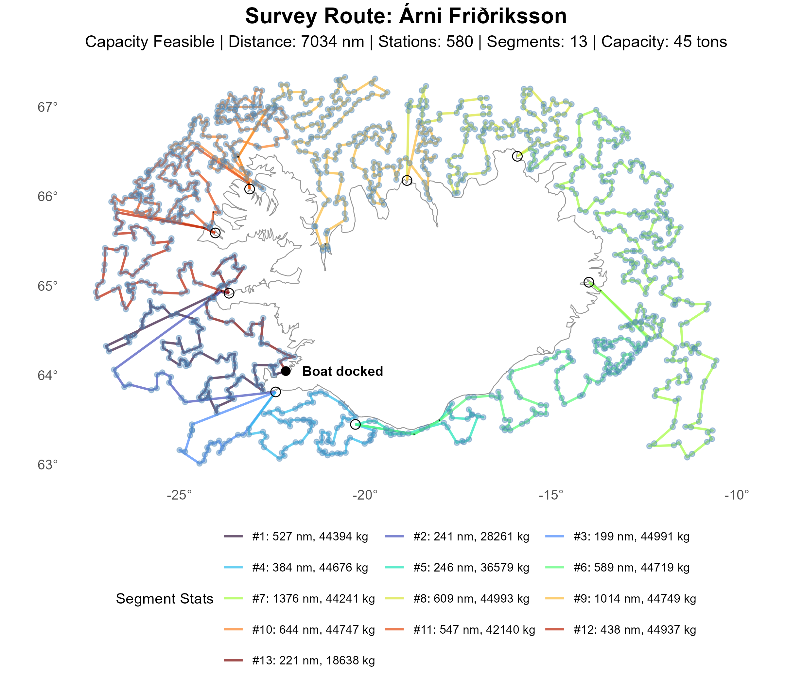

# OPT Initialization (Optimal No‑Port TSP)

The OPT initialization constructs the station ordering by first solving the optimal no‑port directed
Traveling Salesman Problem (NP‑MIP) over all stations. This produces a globally optimal port‑free
tour that minimizes total travel distance under the directed, waypoint‑aware distance model. Once
this optimal ordering is obtained, ports are inserted as needed to satisfy vessel capacity, creating
a capacity‑feasible segmented tour.

Because this initialization begins from a fully optimized TSP solution, it typically yields very
high‑quality and well‑structured initial orderings, providing a strong baseline for subsequent
refinement by the matheuristic. However, achieving this quality requires solving a computationally
intensive NP‑MIP, and thus OPT incurs a significantly higher preprocessing cost than greedy
heuristics such as NN, CI, or GE.

Despite the added computational effort, OPT consistently produces the strongest initial routes among
the evaluated strategies and often leads to the best final solutions after boundary‑sweep
refinement.

