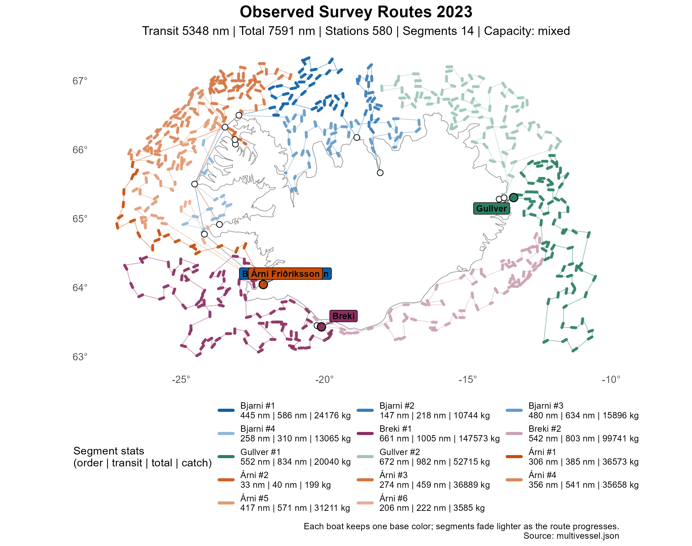

# Historical Survey — Spring 2023

Observed survey routes for all four vessels, exported from `dat/survey2023spring.dat`.

Produced by `make -C src survey`. Plots regenerated by `make -C src plot`.

-----

## Route Plotting

<table><tr>
<td align="center"> Combined fleet — transit 5,348.20 nm · total 7,591.06 nm</td>
</tr></table>

## Segment Summary

### Boat 1: Bjarni Sæmundsson

|   Segment |  Length | Stations |     Catch | Transit (nm) | Total (nm) |
|----------:|--------:|---------:|----------:|-------------:|-----------:|
|         1 |      38 |       36 |     24176 |       444.57 |     585.60 |
|         2 |      20 |       18 |     10744 |       147.05 |     218.42 |
|         3 |      44 |       42 |     15896 |       480.17 |     633.66 |
|         4 |      17 |       15 |     13065 |       257.82 |     310.19 |
| **Total** | **119** |  **111** | **63881** |  **1329.60** | **1747.87** |

### Boat 2: Árni Friðriksson

|   Segment |  Length | Stations |      Catch | Transit (nm) | Total (nm) |
|----------:|--------:|---------:|-----------:|-------------:|-----------:|
|         1 |      22 |       20 |      36573 |       305.72 |     384.70 |
|         2 |       5 |        3 |        199 |        32.71 |      40.18 |
|         3 |      49 |       47 |      36889 |       273.85 |     458.88 |
|         4 |      50 |       48 |      35658 |       356.36 |     541.47 |
|         5 |      43 |       41 |      31211 |       416.85 |     571.49 |
|         6 |       7 |        5 |       3585 |       206.38 |     222.24 |
| **Total** | **176** |  **164** | **144115** |  **1591.86** | **2218.98** |

### Boat 3: Gullver

|   Segment |  Length | Stations |     Catch | Transit (nm) | Total (nm) |
|----------:|--------:|---------:|----------:|-------------:|-----------:|
|         1 |      73 |       71 |     20040 |       551.55 |     833.70 |
|         2 |      82 |       80 |     52715 |       672.02 |     982.03 |
| **Total** | **155** |  **151** | **72755** |  **1223.57** | **1815.73** |

### Boat 4: Breki

|   Segment |  Length | Stations |      Catch | Transit (nm) | Total (nm) |
|----------:|--------:|---------:|-----------:|-------------:|-----------:|
|         1 |      89 |       87 |     147573 |       661.38 |    1005.21 |
|         2 |      68 |       67 |      99741 |       541.80 |     803.28 |
| **Total** | **157** |  **154** | **247314** |  **1203.17** | **1808.48** |

### Fleet Summary

This table is taken from `multivessel.log`.

|    ID     | Boat              | Segments |   Nodes | Stations | Total Catch | Transit (nm) | Total (nm) | Feasible  |
|:---------:|-------------------|---------:|--------:|---------:|------------:|-------------:|-----------:|-----------|
|     1     | Bjarni Sæmundsson |        4 |     120 |      111 |       63881 |      1329.60 |    1747.87 | false[^1] |
|     2     | Árni Friðriksson  |        6 |     177 |      164 |      144115 |      1591.86 |    2218.98 | true      |
|     3     | Gullver           |        2 |     156 |      151 |       72755 |      1223.57 |    1815.73 | true      |
|     4     | Breki             |        2 |     157 |      154 |      247314 |      1203.17 |    1808.48 | true      |
| **Total** |                   |   **14** | **610** |  **580** |  **528065** |  **5348.20** | **7591.06** |           |

[^1]: The exported survey route is retained for plotting even though at least one boat exceeds capacity.

