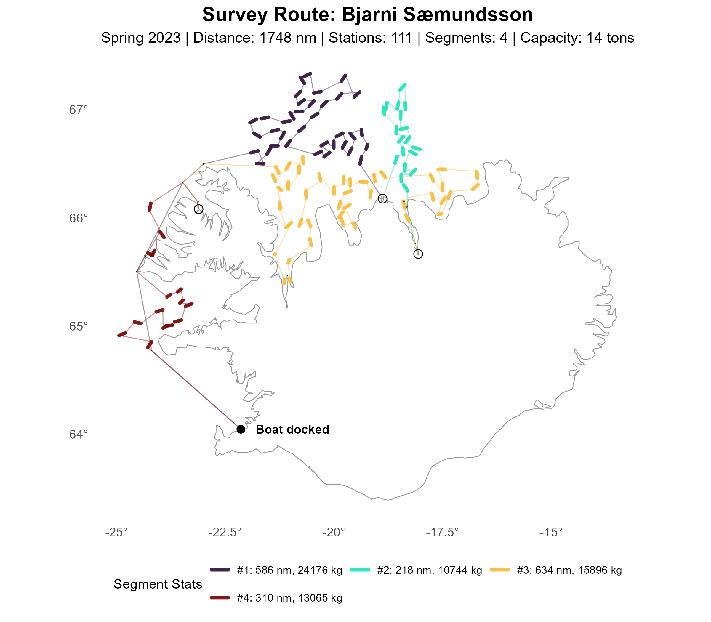
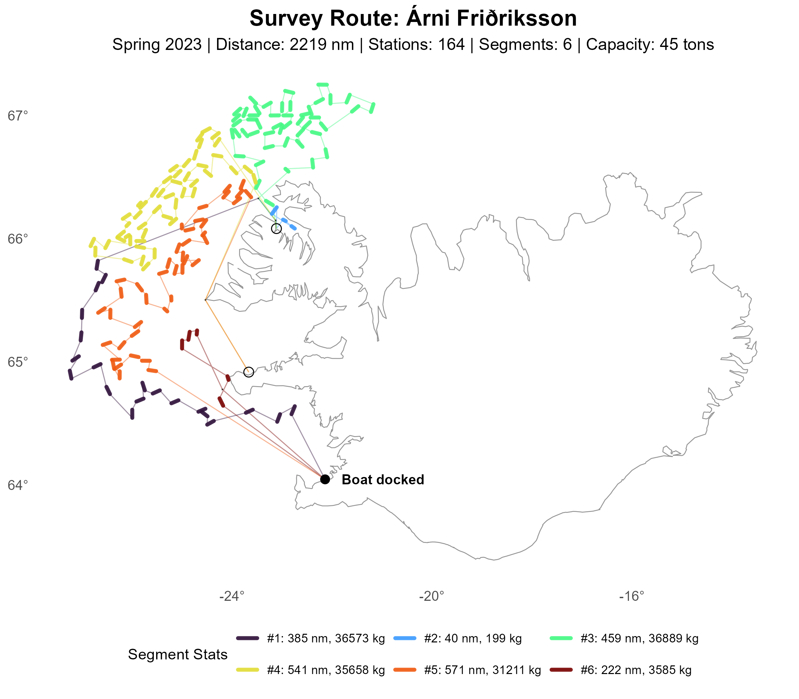
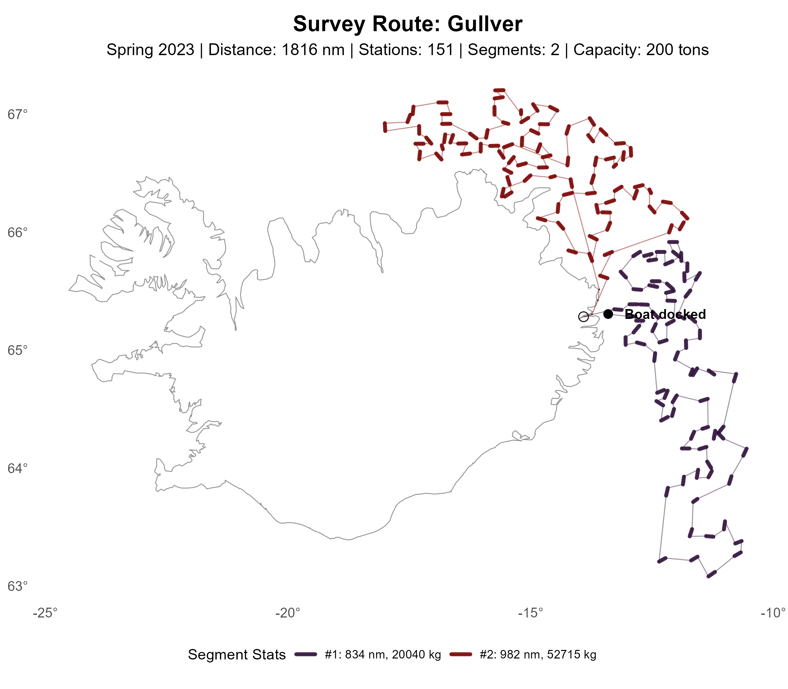
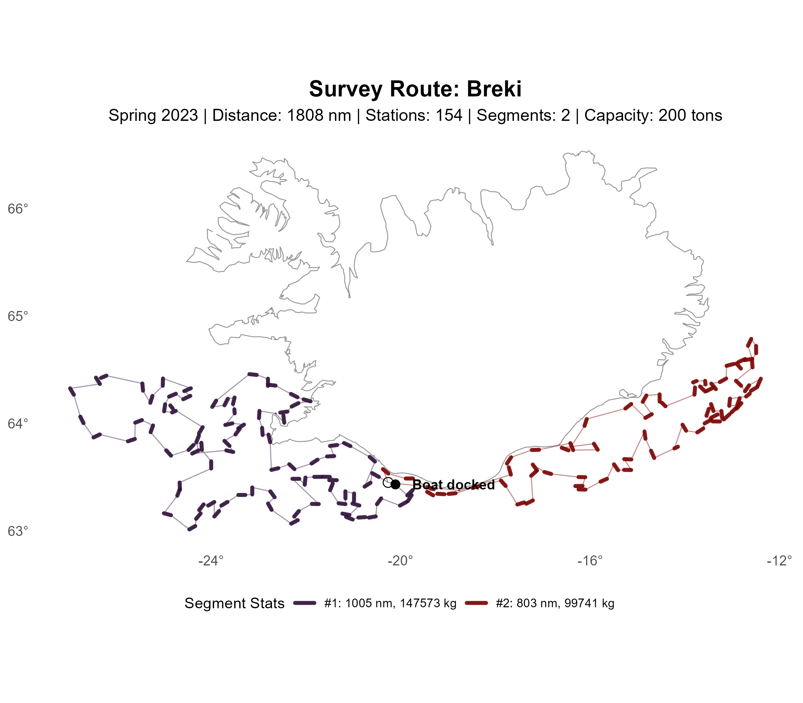
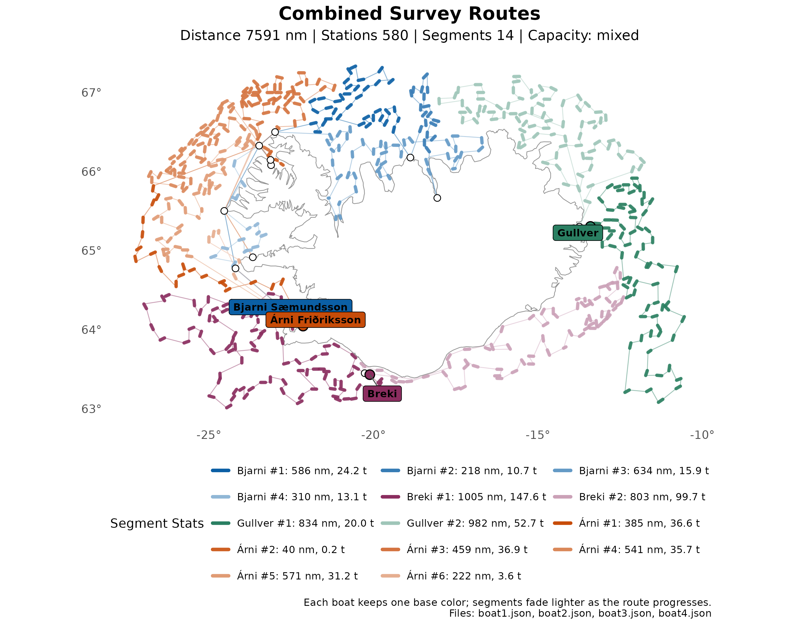

# Historical Survey Outputs

This folder contains the exported historical survey routes:

- `boat1.json` to `boat4.json`
- `boat1.png` to `boat4.png`

The original ordered survey input is:

- `dat/survey2023spring.dat`

The database used to resolve `boat_id`, `station_id`, and `port_id` is:

- `dat/gsp_data.db`

The JSON files here are produced by:

```bash
make -C src survey
```

That workflow:

1. reads `dat/survey2023spring.dat`
2. rebuilds the `survey` table from existing boats, stations, and ports already in `dat/gsp_data.db`
3. exports `boat*.json`

To regenerate a PNG from one of the JSON files:

```bash
Rscript R/plot_single_vessel_route.R sol/survey/boat1.json
```

Examples:

```bash
Rscript R/plot_single_vessel_route.R sol/survey/boat2.json
Rscript R/plot_single_vessel_route.R sol/survey/boat3.json
Rscript R/plot_single_vessel_route.R sol/survey/boat4.json
Rscript R/plot_multi_vessel_route.R "sol/survey/boat*.json" sol/survey/routes_combined.png dat/gsp.db
```

The corresponding PNG is written next to the JSON file, for example:

- `sol/survey/boat1.png`

-----

## Route Plotting






## Segment Summary

### Boat 1: Bjarni Sæmundsson

|   Segment |  Length | Stations |     Catch | Distance (nm) |
|----------:|--------:|---------:|----------:|--------------:|
|         1 |      38 |       36 |     24176 |        585.60 |
|         2 |      20 |       18 |     10744 |        218.42 |
|         3 |      44 |       42 |     15896 |        633.66 |
|         4 |      17 |       15 |     13065 |        310.19 |
| **Total** | **119** |  **111** | **63881** |   **1747.87** |

### Boat 2: Árni Friðriksson

|   Segment |  Length | Stations |      Catch | Distance (nm) |
|----------:|--------:|---------:|-----------:|--------------:|
|         1 |      22 |       20 |      36573 |        384.70 |
|         2 |       5 |        3 |        199 |         40.18 |
|         3 |      49 |       47 |      36889 |        458.88 |
|         4 |      50 |       48 |      35658 |        541.47 |
|         5 |      43 |       41 |      31211 |        571.49 |
|         6 |       7 |        5 |       3585 |        222.24 |
| **Total** | **176** |  **164** | **144115** |   **2218.98** |

### Boat 3: Gullver

|   Segment |  Length | Stations |     Catch | Distance (nm) |
|----------:|--------:|---------:|----------:|--------------:|
|         1 |      73 |       71 |     20040 |        833.70 |
|         2 |      82 |       80 |     52715 |        982.03 |
| **Total** | **155** |  **151** | **72755** |   **1815.73** |

### Boat 4: Breki

|   Segment |  Length | Stations |      Catch | Distance (nm) |
|----------:|--------:|---------:|-----------:|--------------:|
|         1 |      89 |       87 |     147573 |       1005.21 |
|         2 |      68 |       67 |      99741 |        803.28 |
| **Total** | **157** |  **154** | **247314** |   **1808.48** |

### Fleet Summary

|    ID     | Boat              | Segments |   Nodes | Stations | Total Catch | Distance (nm) | Feasible  |
|:---------:|-------------------|---------:|--------:|---------:|------------:|--------------:|-----------|
|     1     | Bjarni Sæmundsson |        4 |     120 |      111 |       63881 |       1747.87 | false[^1] |
|     2     | Árni Friðriksson  |        6 |     177 |      164 |      144115 |       2218.98 | true      |
|     3     | Gullver           |        2 |     156 |      151 |       72755 |       1815.73 | true      |
|     4     | Breki             |        2 |     157 |      154 |      247314 |       1808.48 | true      |
| **Total** |                   |   **14** | **610** |  **580** |  **528065** |   **7591.06** |           |

[^1]: Capacity violations: segment 1 and segment 3 exceed capacity `14000`.



-----
